### About
<body style="text-transform: capitalize;">
My name is IRANZI Thierry and I am a student at George Fox De Kagarama. I have a wide array projects and a diverse skills in web development <b>Frontend && Backend , API development , SPA(Single Page Application) , Database Designer , IT Support</b>

 
- <b>🔭 I’m currently working on</b> ...
  * Adding New features to my music downloader app <a href="https://e-sound.onrender.com"><b>eSound</b></a>
  * Making posts on my blog Website  <a href="https://iranzi.hashnode.dev"><b>Iranzi Dev</b></a>
  * Completing E-learning SPA YouthCodeCamp <a href="https://youth-code-camp-b3de8bd6f16f.herokuapp.com/"><b>Youth Code Camp</b></a>
  * Possibly pushing out a new concept when time permits

- 📔 I plan on working on ... 
  * Build several neural networks and explore more advanced techniques like natural language processing
  * Building Gutwara.com clone with inertia.js , vue3 and laravel 10 

- <b>🌱 I’m currently learning</b> ...
  * Completing Machine learning FreeCodeCamp certification
  * Machine Learning
  * Mobile App Development
  * Penetration Testing
  * Malware Analysis 

- <b>👯 I’m looking to collaborate on</b> ...
  * Well documented projects
  * Anything of interest
</body>
